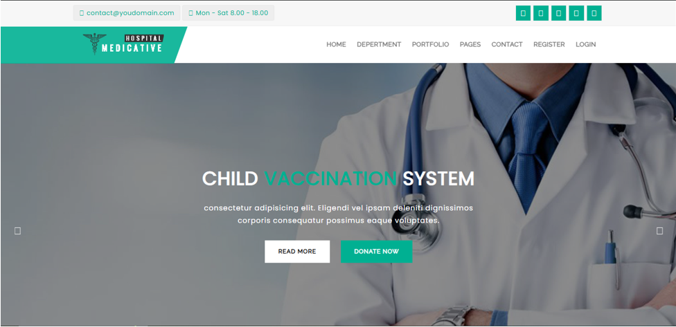
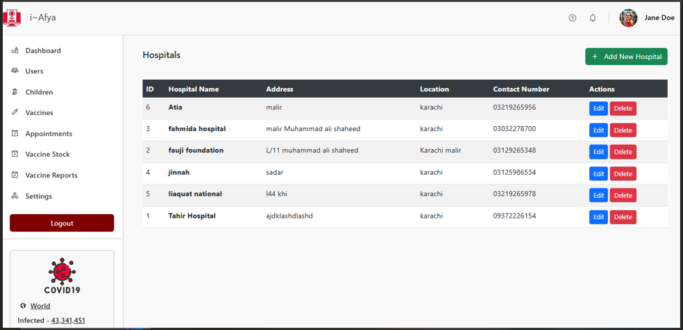
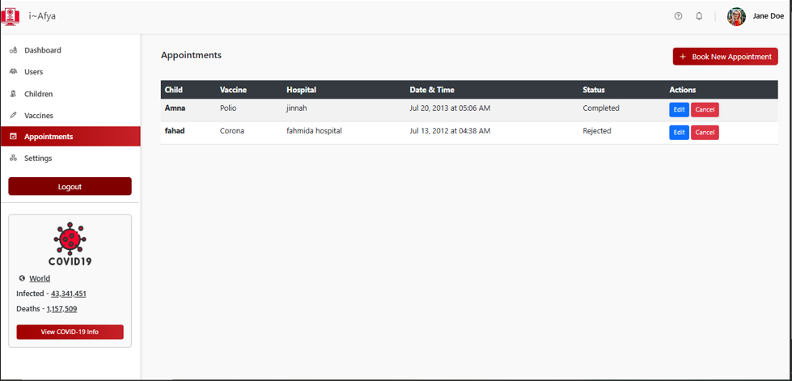
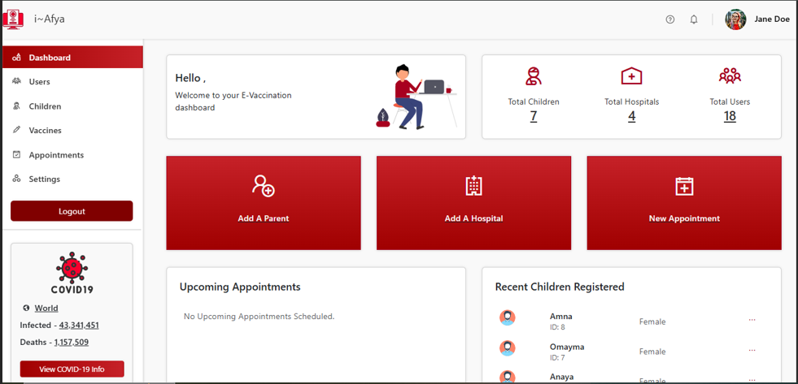
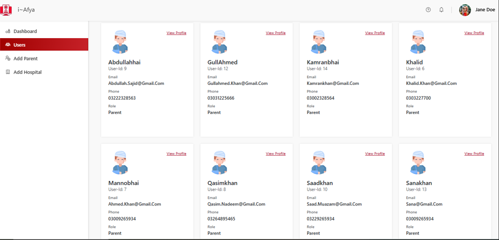
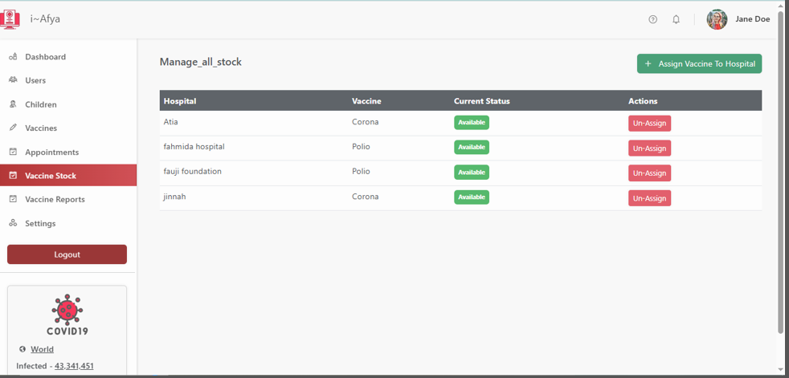

# Child Vaccination System

A web-based child vaccination management system that connects parents, hospitals and administrators in one platform. Parents can book vaccination appointments for their children, hospitals manage their vaccine stock and appointments, and the admin oversees the whole system.

## User Roles

**Admin**
- Manages hospitals and users
- Monitors vaccine stock and appointments from the dashboard

**Hospital**
- Manages vaccine stock
- Views and handles patient appointments

**Patient (Parent)**
- Registers and logs in
- Finds hospitals and books vaccination appointments for their child

## Tech Stack
- Add your technologies here (e.g. ASP.NET Core MVC, C#, SQL Server)

## Screenshots

### Home Page

### About Us

### Hospitals

### Appointments

### Admin Dashboard

### Users Management

### Vaccine Stock

